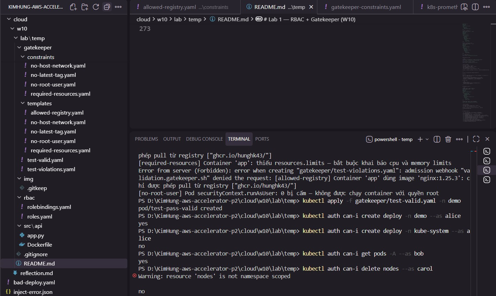
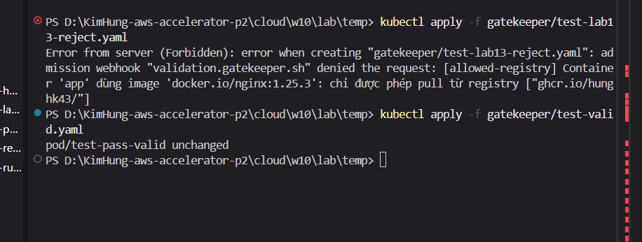
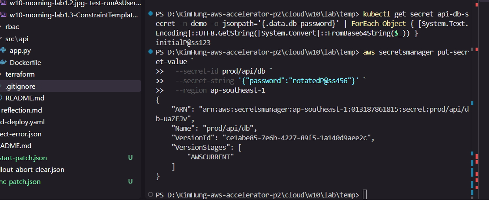
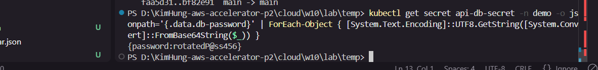
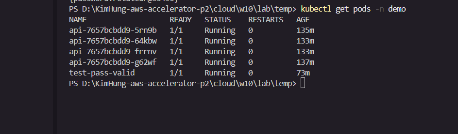
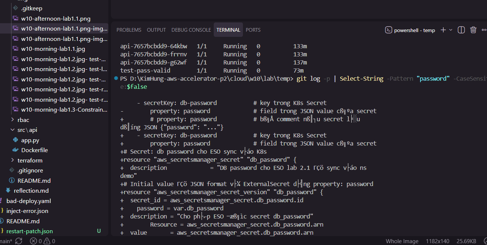
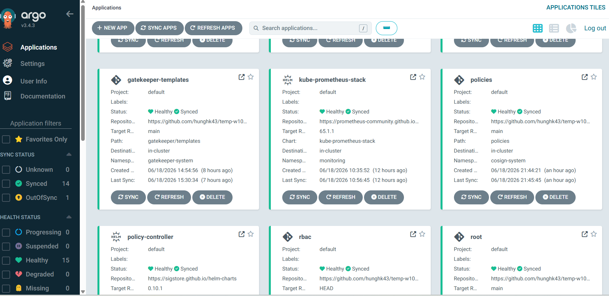

# W10 Lab — RBAC + Gatekeeper + Trivy + Cosign

> GitOps-only: mọi thứ qua ArgoCD — không `kubectl apply` tay.
> Repo: https://github.com/hunghk43/temp-w10

---

## Cấu trúc repo

```
.
├── rbac/
│   ├── roles.yaml            # Role (alice) + ClusterRole (bob, carol)
│   └── rolebindings.yaml     # 3 binding gán user vào role
├── gatekeeper/
│   ├── templates/            # 5 ConstraintTemplate (Rego)
│   │   ├── no-latest-tag.yaml
│   │   ├── required-resources.yaml
│   │   ├── no-root-user.yaml
│   │   ├── no-host-network.yaml
│   │   └── allowed-registry.yaml
│   ├── constraints/          # 5 Constraint tương ứng
│   ├── test-violations.yaml  # 5 Pod vi phạm → expect REJECT
│   └── test-valid.yaml       # 1 Pod hợp lệ → expect PASS
├── policies/
│   └── cluster-image-policy.yaml   # ClusterImagePolicy (Sigstore)
├── signing/
│   └── cosign.pub            # Public key verify image signature
├── .github/workflows/
│   └── build-push.yml        # CI: Trivy scan + Cosign sign
├── argocd/
│   ├── root.yaml             # App-of-Apps
│   └── apps/
│       ├── rbac.yaml
│       ├── gatekeeper-controller.yaml   # sync-wave: 0
│       ├── gatekeeper-templates.yaml    # sync-wave: 1
│       ├── gatekeeper-constraints.yaml  # sync-wave: 2
│       ├── policy-controller.yaml       # sync-wave: 1 (Sigstore)
│       └── policies.yaml                # sync-wave: 2 (ClusterImagePolicy)
└── img/                      # Evidence screenshots
```

---

# Buổi sáng — RBAC + Gatekeeper

## Lab 1.1 — RBAC

### Thiết kế phân quyền

| User  | Kind | Role/ClusterRole     | Scope     | Quyền                                      |
|-------|------|----------------------|-----------|--------------------------------------------|
| alice | User | developer (Role)     | ns `demo` | CRUD deploy/pod/service/rollout            |
| bob   | User | sre (ClusterRole)    | cluster   | get/list/watch tất cả + delete pod + scale |
| carol | User | viewer (ClusterRole) | cluster   | get/list/watch only                        |

- alice → `Role` (namespace-scoped) vì chỉ làm việc trong `demo`
- bob/carol → `ClusterRole` vì cần quyền toàn cụm
- carol không có create/delete/update bất kỳ resource nào

### Nghiệm thu Lab 1.1

| Lệnh | Kỳ vọng | Kết quả |
|------|---------|---------|
| `can-i create deploy -n demo --as alice` | yes | ✅ |
| `can-i create deploy -n kube-system --as alice` | no | ✅ |
| `can-i get pods -A --as bob` | yes | ✅ |
| `can-i delete nodes --as carol` | no | ✅ |



---

## Lab 1.2 — Gatekeeper

### 4 luật enforcement (namespace `demo`)

| # | Rule | ConstraintTemplate | Risk |
|---|------|--------------------|------|
| 1 | Cấm image tag `:latest` | `K8sNoLatestTag` | F-01 |
| 2 | Bắt buộc `resources.limits` (cpu + memory) | `K8sRequiredResources` | F-02 |
| 3 | Cấm `runAsUser: 0` (root) | `K8sNoRootUser` | F-04 |
| 4 | Cấm `hostNetwork: true` | `K8sNoHostNetwork` | — |

### Thứ tự deploy (sync-wave)

```
wave 0 → gatekeeper-controller   (helm chart install)
wave 1 → gatekeeper-templates    (ConstraintTemplate CRDs)
wave 2 → gatekeeper-constraints  (Constraint objects)
```

### Nghiệm thu Lab 1.2

| Test | Kỳ vọng | Kết quả |
|------|---------|---------|
| Pod image `:latest` | reject | ✅ |
| Pod thiếu `resources.limits` | reject | ✅ |
| Pod `runAsUser: 0` | reject | ✅ |
| Pod `hostNetwork: true` | reject | ✅ |
| Pod hợp lệ (pinned + limits + non-root) | pass | ✅ |


---

## Lab 1.3 — Custom Policy (Registry Whitelist)

Chặn tất cả image không xuất phát từ `ghcr.io/hunghk43/`. Chỉ registry của repo cá nhân được phép pull.

- ConstraintTemplate: `K8sAllowedRegistry` (tự viết Rego)
- Constraint: `allowed-registry` — `enforcementAction: deny`
- Parameter: `allowedRegistries: ["ghcr.io/hunghk43/"]`

### Rego logic

```rego
_is_allowed(image) {
  registry := input.parameters.allowedRegistries[_]
  startswith(image, registry)
}
```

### Nghiệm thu Lab 1.3

| Test | Kỳ vọng | Kết quả |
|------|---------|---------|
| Pod image `docker.io/nginx:1.25.3` | reject | ✅ |
| Pod image `ghcr.io/hunghk43/w10-api:*` | pass | ✅ |



---

# Buổi chiều — ESO + Supply Chain

## Lab 2.1 — ESO (External Secrets Operator)

ArgoCD sync External Secrets Operator + ExternalSecret lấy secret từ AWS Secrets Manager / SSM vào cluster.

### Thứ tự deploy

```
wave 0 → eso (cài ESO operator qua Helm)
wave 1 → eso-config (SecretStore + ExternalSecret)
```

### Nghiệm thu Lab 2.1









---

## Lab 2.2 — Trivy + Cosign (Supply Chain Security)

Cluster chỉ được chạy image đã scan sạch CVE và đã ký.

### Kiến trúc

```
CI (GitHub Actions)
  └── Build image
  └── Trivy scan → fail nếu có CVE HIGH/CRITICAL
  └── Push image (chỉ sau khi scan pass)
  └── Cosign sign --key (private key từ GitHub Secret)

Cluster (Admission)
  └── Sigstore Policy Controller
  └── ClusterImagePolicy → verify signature bằng cosign.pub
  └── Namespace demo có label: policy.sigstore.dev/include=true
```

### Files chính

| File | Mục đích |
|------|---------|
| `.github/workflows/build-push.yml` | CI: Trivy + Cosign sign |
| `signing/cosign.pub` | Public key verify |
| `policies/cluster-image-policy.yaml` | ClusterImagePolicy với public key |
| `argocd/apps/policy-controller.yaml` | Cài Sigstore Policy Controller (wave 1) |
| `argocd/apps/policies.yaml` | Sync ClusterImagePolicy (wave 2) |

### Nghiệm thu Lab 2.2

| Tình huống | Kỳ vọng | Kết quả |
|-----------|---------|---------|
| Push image chứa CVE HIGH | CI đỏ | ✅ |
| Deploy image chưa ký | admission reject | ✅ |
| Deploy image đã ký (từ CI) | pass | ✅ |

**CI xanh + image đã ký:**




**Admission reject image chưa ký:**


**Policy Controller + Policies Healthy trên ArgoCD:**


---

## Checklist nộp bài

### Buổi sáng
- [x] `rbac/roles.yaml` — 3 role (Role + 2 ClusterRole)
- [x] `rbac/rolebindings.yaml` — 3 binding
- [x] `argocd/apps/rbac.yaml` — ArgoCD App for RBAC
- [x] `gatekeeper/templates/` — 5 ConstraintTemplate (4 luật + 1 custom)
- [x] `gatekeeper/constraints/` — 5 Constraint với `enforcementAction: deny`
- [x] `argocd/apps/gatekeeper-controller.yaml` — sync-wave: 0
- [x] `argocd/apps/gatekeeper-templates.yaml` — sync-wave: 1
- [x] `argocd/apps/gatekeeper-constraints.yaml` — sync-wave: 2
- [x] `auth can-i` 4 lệnh đúng kỳ vọng
- [x] 4 constraint reject vi phạm, pass pod hợp lệ
- [x] Lab 1.3 custom Rego policy — reject registry ngoài whitelist

### Buổi chiều
- [x] `eso/` — SecretStore + ExternalSecret
- [x] `argocd/apps/eso.yaml` + `eso-config.yaml` — ArgoCD Apps
- [x] `.github/workflows/build-push.yml` — Trivy scan (exit-code 1) + Cosign sign
- [x] `signing/cosign.pub` — public key committed
- [x] `policies/cluster-image-policy.yaml` — ClusterImagePolicy với public key
- [x] `argocd/apps/policy-controller.yaml` — Sigstore Policy Controller
- [x] `argocd/apps/policies.yaml` — ClusterImagePolicy sync
- [x] CI đỏ khi CVE HIGH, xanh khi sạch
- [x] Admission reject image chưa ký (`policy.sigstore.dev`)
- [x] Image đã ký từ CI deploy pass
